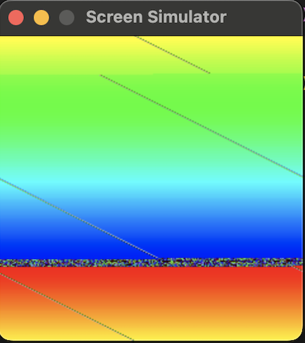
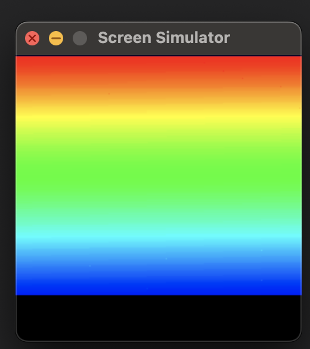

# Python LCD Simulator 

This is an explority project. Instead of buying an small [240x240px LCD](https://www.waveshare.com/wiki/1.28inch_Touch_LCD#Parameters), I decided to create a simulator of a screen on my mac. I then made an ESP-32 control this through serial communication. 

The goal was to understand some of the problems that might happen with these technologies and how they work.

## Challenges

- Biggest challenge was the speed of data transmission. Between serial port communciation and python not being fast enough. If I kept playing with the speed of the program, I could speed up the python script. But ultimately, I should use something else other than Python. Python is just too slow for this.
- Another issue I found was how difficult it was to keep things in sync. If the ESP-32 device reset or any issues occured, the pixels would be out of sync. As shown below

 

- I had various other issues, but ultimately the project was a great learning experience. I learned a lot about how they use other lines of communicate to keep things in sync including a clock, reset, and data control pin. This all help keep the information in sync. In addition, this would be a lot easier if I didn't have to deal with python as it is very slow. I felt like it was a quick language to write it in but soon discovered it is extremly slow.

## Current State

Due to time constraints, I moved on from this project. But at the current state, this is what is looks like. We are loosing some rows because of the serial speed. Thats why it is squished.

## Usage

*This is a very fragile project, I doubt it would work on peoples machines as it has a lot to do with speed of computer, ESP-32 device you have, etc..*

*But.... if you are so bold and want to try.*

1. Compile the `main.c` and upload it to the ESP-32. I use PlatformIO VSCode extension for this.

2. Make sure you have or install `python3, pip3, and venv`

3. Activate you venv environment and run `pip install -r requirements.txt` to get the python dependencies

4. Run `python3 simulated-lcd.py`